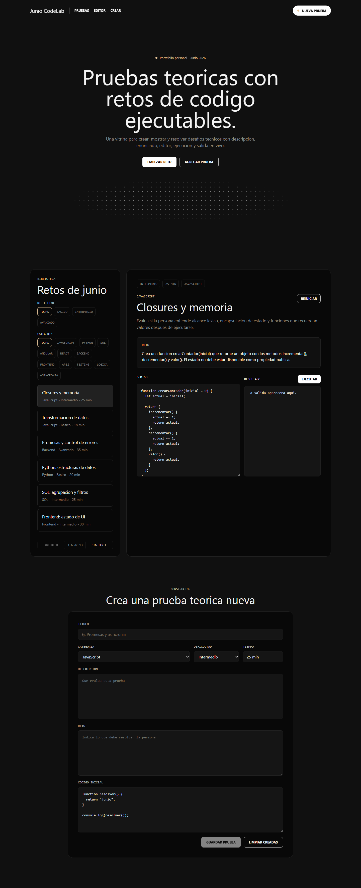
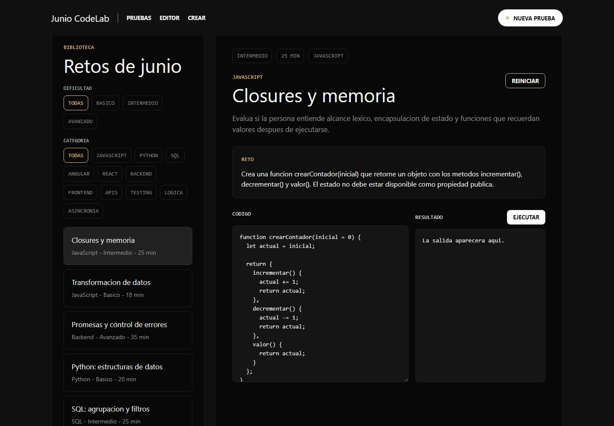
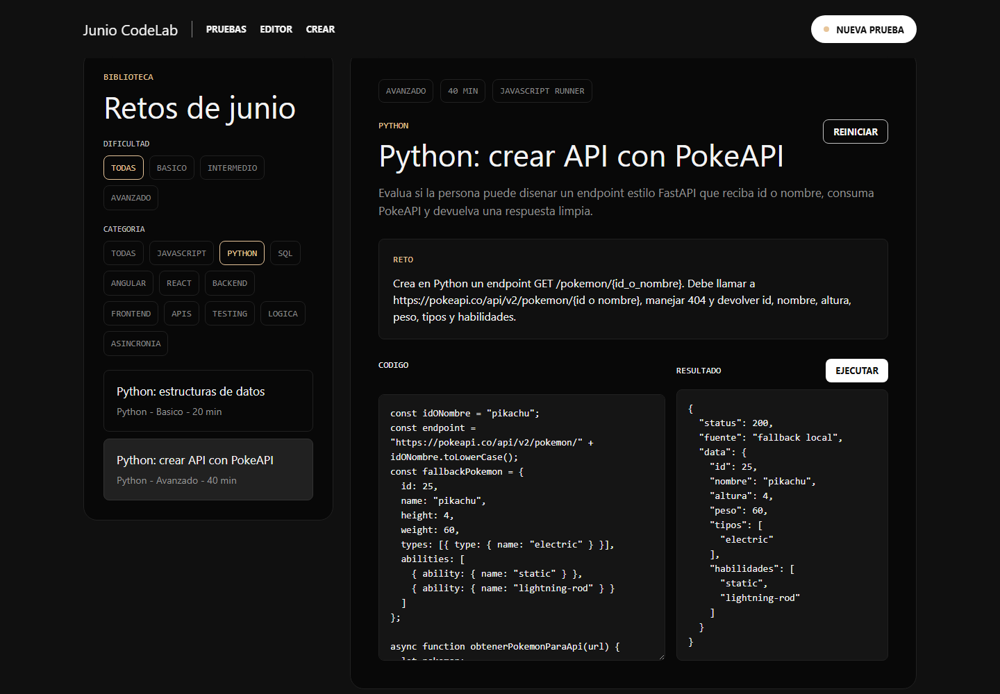

# Junio CodeLab

App Angular para crear, filtrar y resolver pruebas teoricas con retos de codigo ejecutables. Esta pensada como pieza de portafolio para mostrar experiencia creando ejercicios tecnicos por categoria, dificultad y stack.



## Que hace

- Crea pruebas teoricas con titulo, categoria, dificultad, descripcion, reto y codigo inicial.
- Muestra retos por categorias como JavaScript, Python, SQL, Angular, React, Backend, Frontend, APIs, Testing, Logica y Asincronia.
- Filtra por dificultad: Todas, Basico, Intermedio y Avanzado.
- Pagina el listado de pruebas de 6 en 6.
- Ejecuta codigo JavaScript desde el navegador y muestra el resultado.
- Guarda pruebas creadas en `localStorage`.
- Incluye retos con PokeAPI: `https://pokeapi.co/api/v2/pokemon/{id o nombre}`.

## Capturas

### Biblioteca y editor



### Resultado PokeAPI



## Stack

- Angular 21
- TypeScript
- CSS
- Playwright para verificacion visual
- PokeAPI como API publica de ejemplo

## Categorias incluidas

- JavaScript
- Python
- SQL
- Angular
- React
- Backend
- Frontend
- APIs
- Testing
- Logica
- Asincronia

## Ejecutar localmente

Instala dependencias:

```bash
npm.cmd install
```

Compila la app:

```bash
npm.cmd run build
```

Sirve la version compilada:

```bash
npm.cmd run preview
```

Abre:

```text
http://localhost:4200
```

## Modo desarrollo

```bash
npm.cmd start
```

En este entorno, `preview` suele ser mas estable porque sirve directamente el build generado.

## Verificacion

```bash
npm.cmd run verify:ui
```

Generar capturas para el README:

```bash
npm.cmd run screenshots
```

## Nota sobre PokeAPI

Los retos de PokeAPI intentan consultar la API real. Si el navegador o el entorno bloquea llamadas externas dentro del runner, la prueba usa un fallback local para que siempre exista una salida visible y evaluable.
